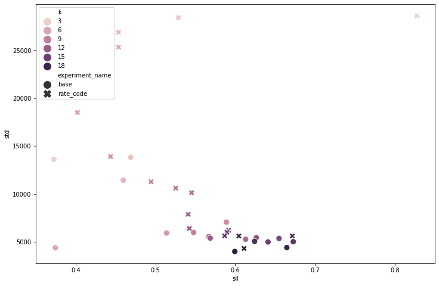
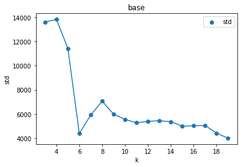
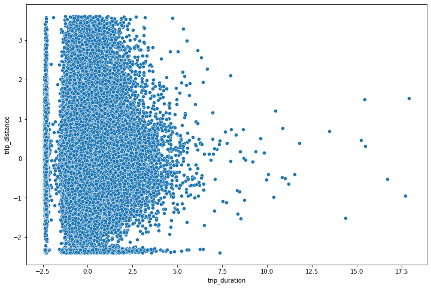
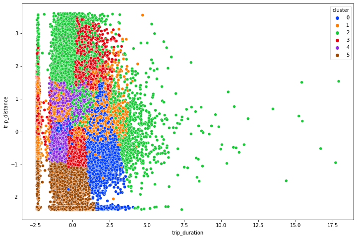
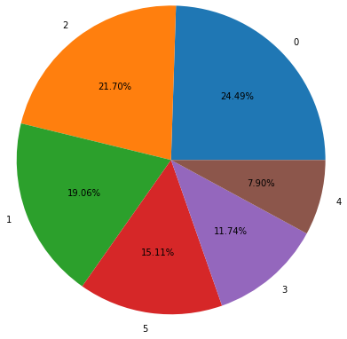
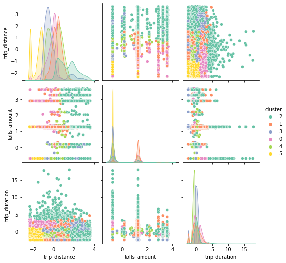

# Project Title
## How Can I Make A Million Dollars?
Market Research Based On New York Taxi Trip Dataset By KMeans Algorithm
# Dataset Link

https://www.kaggle.com/datasets/neilclack/nyc-taxi-trip-data-google-public-data

Columns=21 , Rows=8,319,928 
# Business Strategy
1) Discover opportunity in the market
2) Develop my own application
3) Make a Million Dollars by targeting people
# Optimise K
https://github.com/borhanfar/Taxi-databricks-notebook

Looking for the highest sil score and the lowest std. Therefore, K=18.

However, K=18 is not practical. Because, It is very difficult to explain the behaviour of 18 groups.

# what is the best K?

K=6

# Dataset before clustering 

# Dataset after clustering (K=6)

# Portion of each cluster

# Understanding the clusters

# Cluster number 2

They are going all across the city by taxi.
They do not like Public Transportation.
They do not even bother get the Uber.

They are wealthy.

Cluster 2 = 21.70% of whole dataset = 1,805,424

# Business Plan
1) Find those taxi which is working in those area.
2) Install my company tablets in those taxi( give them commission ).
3) Because the people who are belongs to cluster nymber 2, are rich and have enough time in the taxi. I can offer discount voucher for luxury brands through our tablet.
4) linked them to luxury brands and gain my commission 

# Profit
If I can send only 200,000 customres from cluster number 2 to luxury brands and get 5$ for each customer.

profit=200,000 X 5$ = 1,000,000$

And

I have 200,000 email from rich people in New York for marketing.

